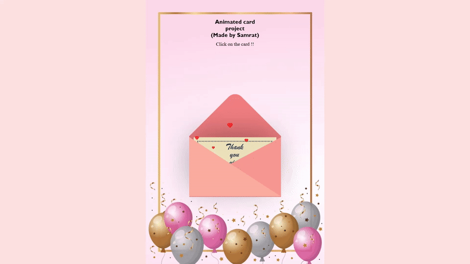

# Animated_greeting_card
Author - Samrat Gharti
Hello everyone, this is the repository for the animated greeting card webpage. This is a project that I made for someone really close to me. 

# 🎉 Animated Greeting Card Project

This is a fun and interactive animated greeting card project built using HTML, CSS, jQuery, and a little creativity ✨. When the user clicks on the envelope, a thank-you card pops out with animated hearts floating around — perfect for digital birthday or thank-you greetings!

## DEMO

## 🚀 Features

- 📩 Animated envelope opening on click
- 💌 Thank-you card slide-up animation
- ❤️ Floating animated hearts using `@keyframes`
- 🎨 Aesthetic UI with a festive background
- 👨‍🎨 Custom styling with creative CSS shapes
- 📱 Fully responsive (adjusts on most screen sizes)

## 🛠️ Technologies Used

- HTML5
- CSS3
- jQuery (for click animation)
- Flexbox layout
- `@keyframes` CSS animations